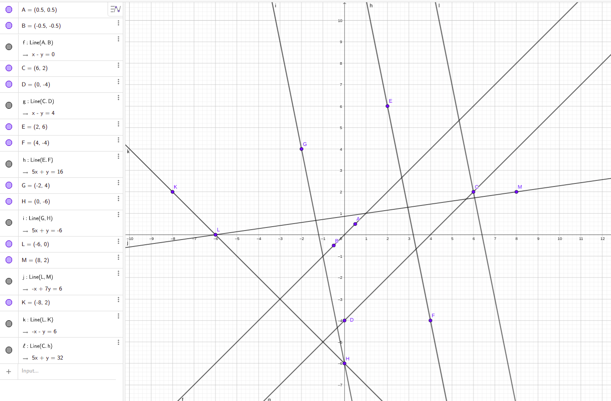

# Лабораторная работа 1

Автор: Гришалевич Надежда

2 курс 2 группа

Весенняя сессия 2021 года

## Вариант 24
- Определить класс Прямая на плоскости (в пространстве), параметры которой задаются с помощью Рациональной Дроби. 
- Определить точки пересечения прямой с осями координат.
- Определить координаты пересечения двух прямых.
- Создать массив/список/множество объектов и определить группы параллельных прямых.

## How to Compile
```bash
javac @sources.txt -d bin -cp bin
java -cp bin by.nhryshalevich.main.Main
```

Lines from the example:

